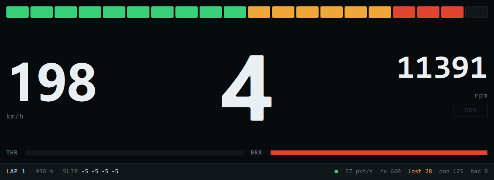

# Racing Telemetry & Control Stack

A real-time telemetry and control system for motorsport, built end to end: from the wire
protocol, through a driver display, to a control law running on a microcontroller, validated
on a hardware-in-the-loop bench.

The plant is a racing simulator. That is a deliberate choice, not a shortcut — it provides a
repeatable, instrumented vehicle model that can be driven to the same corner a hundred times,
which a real car cannot.

> **Status:** Phase 1 of 4 — telemetry link and driver display.



---

## Roadmap

| Phase | Scope | State |
|---|---|---|
| **1** | UDP telemetry protocol, receiver, Qt/QML driver display | Working |
| **2** | Traction control designed against a vehicle plant model, deployed to STM32 over CAN-FD, with a UDS diagnostic server | Planned |
| **3** | Hardware-in-the-loop bench, automated regression in CI, requirement-to-test traceability | Planned |
| **4** | Physical data logger (IMU, GPS, temperatures) and lap analysis in Python | Planned |

---

## Design notes

**The wire format is an ICD, not a struct.** `TelemetryPacket.h` is the single source of truth
for the link. Fixed-width types, explicit packing, little-endian on the wire, and
`static_assert` on `sizeof` so a field inserted in the middle fails the build instead of
silently corrupting a decode. Protocol changes go through `PROTOCOL_VERSION`.

**The stimulus came before the device under test.** `tools/sim_telemetry.py` generates
synthetic telemetry at 60 Hz and can misbehave on demand — `--drop` loses packets, `--jitter`
reorders them. Building it first means the receiver can be developed and tested with no
simulator, no game and no hardware, and it stays useful afterwards as a test fixture: proving
the receiver survives a bad link needs a link you can make bad on purpose.

**Network buffers are copied, never cast.** A datagram has no alignment guarantee and its
length is controlled by the sender, so the receiver checks the size and `memcpy`s into the
struct rather than reinterpreting the buffer in place.

**Loss and reordering are measured separately.** A late packet that arrives after its gap was
already counted is not also a loss — treating them as one number makes a healthy link look
broken and hides the difference between a congested path and a lossy one.

**The display publishes on a clock, not on arrival.** Frames are latched and pushed to the UI
at 60 Hz regardless of how fast telemetry lands, so the display costs the same at 60 Hz as at
500 Hz. Each publish carries the whole frame in one signal: emitting a change per property
would let the screen show this frame's speed beside last frame's gear.

**Link health is on screen, next to the car.** A display that cannot distinguish "the car is
stationary" from "the link is dead" is worse than no display, so packet rate, loss and reject
counts sit in the status strip and the whole readout greys out when frames stop arriving.

---

## Build

Requires Qt 6 (Core, Network, Gui, Quick) and a C++17 compiler.

```bash
cmake -S . -B build -G Ninja -DCMAKE_PREFIX_PATH="C:/Qt/6.11.2/mingw_64"
cmake --build build
```

On Windows the build runs `windeployqt` afterwards, which copies the Qt libraries,
the platform plugin and the QtQuick modules next to the binaries. Without that step
the executables only start from inside Qt Creator, or from a shell with Qt's `bin`
on `PATH`; with it they are double-clickable.

## Run

Start a telemetry source in one terminal:

```bash
python tools/sim_telemetry.py
```

Or drive one. With Assetto Corsa on track, the display reads its telemetry directly:

```bash
./build/telemetry_dash --ac --track-length 7004
```

AC reports lap position as a fraction rather than in metres, so `--track-length`
is what turns it back into distance.

Then either front end. The display:

```bash
./build/telemetry_dash
```

Or the console probe, which prints the same stream as one live line — useful when
debugging the link rather than looking at the car:

```bash
./build/telemetry_probe
```

To verify both survive a degraded link:

```bash
python tools/sim_telemetry.py --drop 0.1 --jitter 0.03
```

`lost` and `ooo` should climb while `bad` stays at zero. The display keeps reading
smoothly through the gaps, and drops to `NO SIGNAL` within half a second of the
source stopping.

The README image is generated, not cropped by hand:

```bash
./build/telemetry_dash --shot docs/dash.png --shot-delay 13500
```

---

## Layout

```
TelemetryPacket.h      Wire format — the contract between producer and consumer
TelemetryReceiver.h    Validating receiver with link statistics
AssettoCorsaSource.h   Adapter: Assetto Corsa's format into this one
tools/ac_probe.py      Derives AC's layout from a live capture
TelemetryModel.h       Presentation model: latches frames, publishes at 60 Hz
qml/Main.qml           Driver display
main_dash.cpp          Display entry point
main.cpp               Console probe, renders at 10 Hz
tools/sim_telemetry.py Synthetic telemetry source with fault injection
```

One receiver, two front ends. The display and the probe share the same
`TelemetryReceiver` without either knowing about the other, which is what made
swapping the lap model underneath a change to one file.

The same cut runs the other way. `AssettoCorsaSource` translates a simulator's
telemetry into `CarTelemetry` and stops there: the model, the display, and the
controller in phase 2 never learn a game is involved. A second simulator is
another adapter and no other change.

## License

MIT
