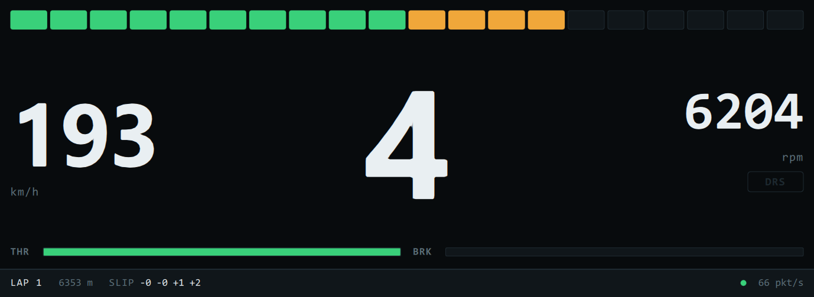
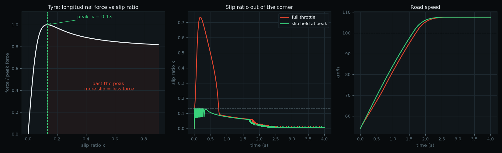
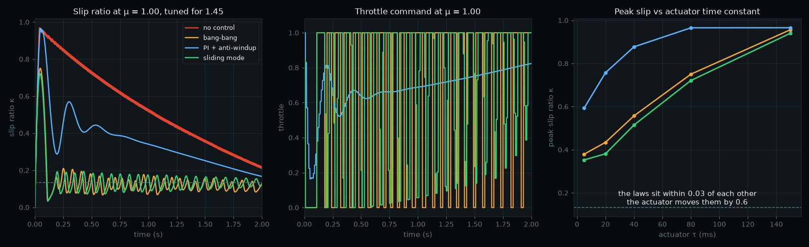
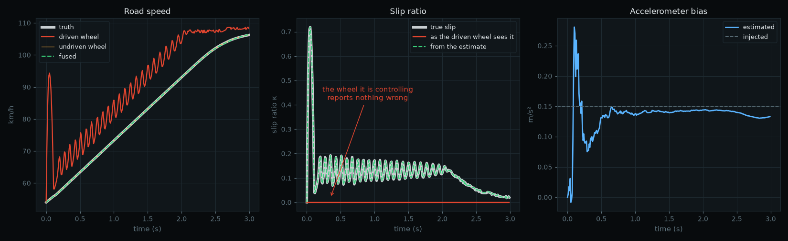

# Racing Telemetry & Control Stack

A real-time telemetry and control system for motorsport, built end to end: from the wire
protocol, through a driver display, to a control law running on a microcontroller, validated
on a hardware-in-the-loop bench.

The plant is a racing simulator. That is a deliberate choice, not a shortcut — it provides a
repeatable, instrumented vehicle model that can be driven to the same corner a hundred times,
which a real car cannot.

> **Status:** Phase 1 of 4 — telemetry link and driver display.



*Reading a Ferrari 458 GT2 at Spa, live from Assetto Corsa. The slip figures are
the giveaway that the wheels are in the right order: zero at the front, positive
at the rear, because the car is rear-wheel drive and under power.*

<details><summary>The same display on the synthetic source, with 5% packet loss injected</summary>


</details>

---

## Roadmap

| Phase | Scope | State |
|---|---|---|
| **1** | UDP telemetry protocol, receiver, Qt/QML driver display | Working |
| **2** | Traction control designed against a vehicle plant model, deployed to STM32 over CAN-FD, with a UDS diagnostic server | Plant model working |
| **3** | Hardware-in-the-loop bench, automated regression in CI, requirement-to-test traceability | Planned |
| **4** | Physical data logger (IMU, GPS, temperatures) and lap analysis in Python | Planned |

---

## Phase 2: the plant

A control law tuned by feel is tuned against whatever the car happened to do that
day. One designed against a model can be argued about, swept over its parameters,
and shown to hold when the tyre is colder than it was on the day.



```bash
python sim/vehicle.py
```

A tyre transmits force *because* it slips a little. Force rises steeply with slip
ratio, peaks near κ = 0.13 on these coefficients, and then falls away. That fall is
the entire problem: past the peak, more wheelspin means less force, so the wheel
accelerates harder, which means still less force. It runs away.

Out of a 54 km/h corner at full throttle the model spikes to κ = 0.74 and takes
three quarters of a second to recover. An oracle holding slip at the peak — not a
controller, a bound — reaches 100 km/h **0.10 s sooner**. On a circuit with eight
slow corners that is most of a second a lap, and it is the budget the controller in
this phase has to recover.

### Comparing control laws

Three laws — threshold cut, PI with anti-windup, and sliding mode with equivalent
control — each configured against μ = 1.45 and then run, untouched, at μ = 1.00.
One column is not a comparison: every law looks competent at the grip it was tuned
for, and the off-design column is the only part that argues anything.



```bash
python sim/compare.py
```

Time to 100 km/h came out the same for all three, to within 0.01 s. That is not a
tie between the laws, it is the tyre: once slip is held near the peak the car is at
the traction limit and no control law can find more. What the laws could differ on
was peak slip and how hard they work the actuator.

They barely did. Sweeping the actuator time constant explains why:

| actuator τ | bang-bang | PI | sliding mode |
|---|---|---|---|
| 5 ms | 0.380 | 0.357 | 0.353 |
| 80 ms | 0.751 | 0.751 | 0.721 |
| 150 ms | 0.957 | 0.957 | 0.941 |

**The choice of law moves peak slip by 0.03. The actuator moves it by 0.60.** The
design lever is the torque path — spark or fuel cut rather than a throttle body —
and not the sophistication of the law sitting behind it.

All three laws limit-cycled in that first run. Sweeping gain against actuator lag
showed why: the PI had been running at Kp = 14 against a limit-cycle boundary of 2
at this actuator. The gain had been chosen by taste, not measured.

```bash
python sim/stability.py
```

Re-run at Kp = 1 — half the boundary, a gain margin of two — the PI stops ringing
and stops working: peak slip 0.966 against 0.969 for no control at all. **At an
80 ms actuator the PI cannot be both stable and quick**, and that is what decides
the comparison. Sliding mode takes most of its authority from the model rather
than from loop gain, so it is not forced into the same trade.

### Road speed, which the car cannot measure

Slip ratio divides by road speed. Everything above used the speed the simulation
knew. A car has wheel speed sensors and an accelerometer, and during a traction
event the driven wheels are by definition the ones that are lying.



```bash
python sim/estimator.py
```

| source of road speed | RMS error (m/s) | resulting slip error |
|---|---|---|
| driven wheel | 2.531 | 0.114 |
| undriven wheel, raw | 0.019 | — |
| **fused, Kalman** | **0.013** | **0.000** |

The first row is the point. Taking road speed from the wheel being controlled is
circular, and it fails in exactly the case the controller exists for: **peak slip
actually reached 0.719, and the driven wheel reports 0.000.** A controller fed
that signal does nothing during a traction event, and passes any bench test that
does not include wheelspin.

The filter estimates accelerometer bias alongside speed, because a bias that is
not estimated integrates into speed and never comes out: 0.133 recovered against
0.150 injected.

**[The design review is written up in full](docs/design-review.md)** — requirement
and what it is worth, assumptions, the three candidates, what separated them, the
margins, the validation plan, and what is still wrong with it.

---

## Design notes

**The wire format is an ICD, not a struct.** `TelemetryPacket.h` is the single source of truth
for the link. Fixed-width types, explicit packing, little-endian on the wire, and
`static_assert` on `sizeof` so a field inserted in the middle fails the build instead of
silently corrupting a decode. Protocol changes go through `PROTOCOL_VERSION`.

**The stimulus came before the device under test.** `tools/sim_telemetry.py` generates
synthetic telemetry at 60 Hz and can misbehave on demand — `--drop` loses packets, `--jitter`
reorders them. Building it first means the receiver can be developed and tested with no
simulator, no game and no hardware, and it stays useful afterwards as a test fixture: proving
the receiver survives a bad link needs a link you can make bad on purpose.

**Network buffers are copied, never cast.** A datagram has no alignment guarantee and its
length is controlled by the sender, so the receiver checks the size and `memcpy`s into the
struct rather than reinterpreting the buffer in place.

**Loss and reordering are measured separately.** A late packet that arrives after its gap was
already counted is not also a loss — treating them as one number makes a healthy link look
broken and hides the difference between a congested path and a lossy one.

**The display publishes on a clock, not on arrival.** Frames are latched and pushed to the UI
at 60 Hz regardless of how fast telemetry lands, so the display costs the same at 60 Hz as at
500 Hz. Each publish carries the whole frame in one signal: emitting a change per property
would let the screen show this frame's speed beside last frame's gear.

**Link health is on screen, next to the car.** A display that cannot distinguish "the car is
stationary" from "the link is dead" is worse than no display, so packet rate, loss and reject
counts sit in the status strip and the whole readout greys out when frames stop arriving.

---

## Build

Requires Qt 6 (Core, Network, Gui, Quick) and a C++17 compiler.

```bash
cmake -S . -B build -G Ninja -DCMAKE_PREFIX_PATH="C:/Qt/6.11.2/mingw_64"
cmake --build build
```

On Windows the build runs `windeployqt` afterwards, which copies the Qt libraries,
the platform plugin and the QtQuick modules next to the binaries. Without that step
the executables only start from inside Qt Creator, or from a shell with Qt's `bin`
on `PATH`; with it they are double-clickable.

## Run

### Two sources

The synthetic one needs nothing installed and can misbehave on demand:

```bash
python tools/sim_telemetry.py
```

Or drive a real one. With Assetto Corsa on track:

```bash
./build/telemetry_dash --ac --track-length 7004
```

AC reports lap position as a fraction of the lap rather than in metres, so
`--track-length` is what turns it back into distance. `--rev-limit` sets where the
shift lights go red, and raises itself if the car revs past it. `--help` lists
every option, generated from the same declarations that parse them.

### Two front ends

The display:

```bash
./build/telemetry_dash
```

Or the console probe, which prints the same stream as one live line — useful when
debugging the link rather than looking at the car:

```bash
./build/telemetry_probe
```

### Proving it survives a bad link

```bash
python tools/sim_telemetry.py --drop 0.1 --jitter 0.03
```

`lost` and `ooo` should climb while `bad` stays at zero. The display keeps reading
smoothly through the gaps, and drops to `NO SIGNAL` within half a second of the
source stopping.

The README image is generated, not cropped by hand:

```bash
./build/telemetry_dash --shot docs/dash.png --shot-delay 13500
```

So is the reel. `tools/make_reel.py` cuts screen recordings to an edit held in
the script, composites the captions, and joins the shots — so re-recording a
shot costs one command rather than an afternoon rebuilding a timeline:

```bash
python tools/make_reel.py --track laps.mkv --bench degraded.mkv -o reel.mp4
```

---

## Layout

```
TelemetryPacket.h      Wire format — the contract between producer and consumer
TelemetryReceiver.h    Validating receiver with link statistics
AssettoCorsaSource.h   Adapter: Assetto Corsa's format into this one
tools/ac_probe.py      Derives AC's layout from a live capture
tools/make_reel.py     Builds the project reel from screen recordings
TelemetryModel.h       Presentation model: latches frames, publishes at 60 Hz
qml/Main.qml           Driver display
main_dash.cpp          Display entry point
main.cpp               Console probe, renders at 10 Hz
tools/sim_telemetry.py Synthetic telemetry source with fault injection
```

One receiver, two front ends. The display and the probe share the same
`TelemetryReceiver` without either knowing about the other, which is what made
swapping the lap model underneath a change to one file.

The same cut runs the other way. `AssettoCorsaSource` translates a simulator's
telemetry into `CarTelemetry` and stops there: the model, the display, and the
controller in phase 2 never learn a game is involved. A second simulator is
another adapter and no other change.

## License

MIT
